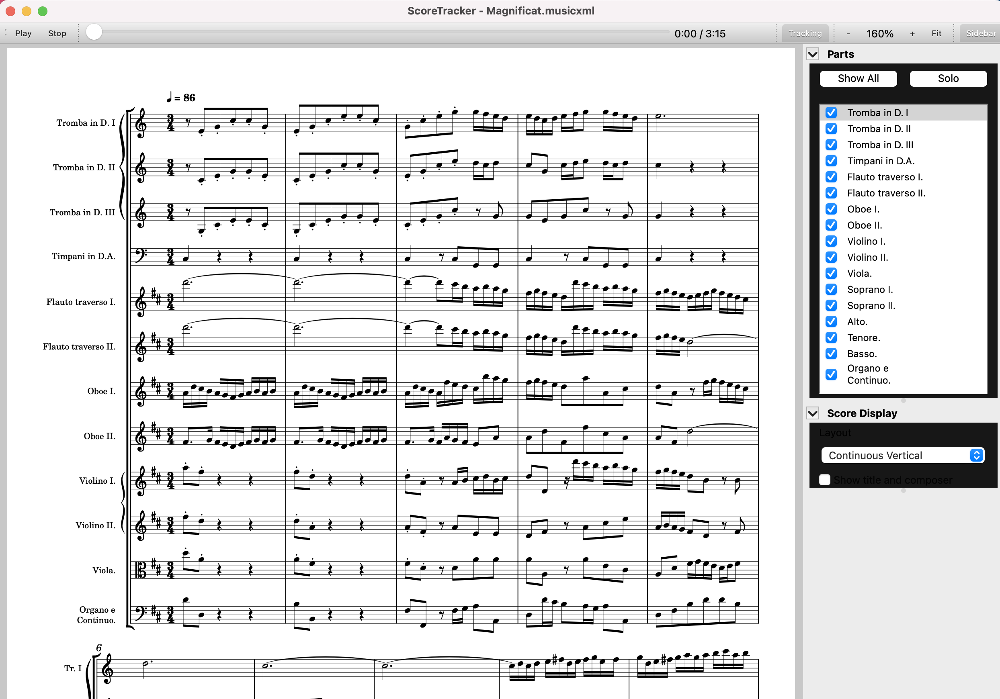

- Sidebar background color actualisation when switching dark day mode:

  - Start app with system in dark mode then switch system to light mode: 
  - Start app with system in light mode then switch system to dark mode: 
